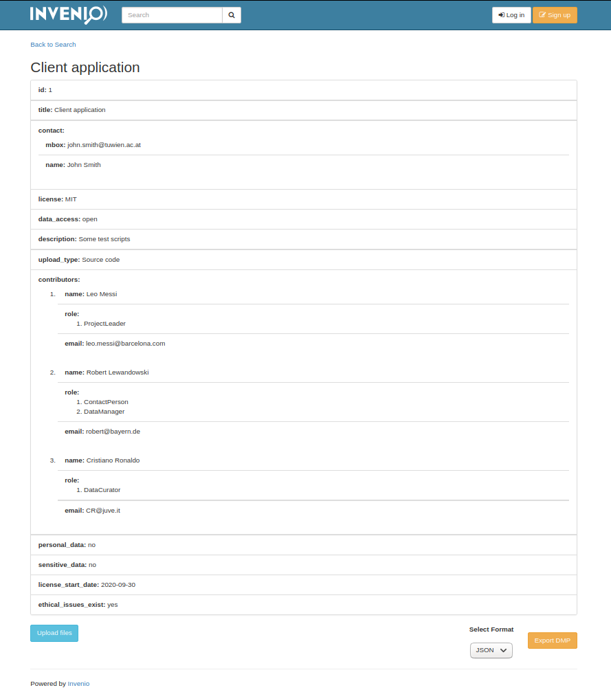

..
    Copyright (C) 2020 Sotirios Tsepelakis.

    invenio-maDMP is free software; you can redistribute it and/or modify
    it under the terms of the MIT License; see LICENSE file for more details.

=============
invenio-maDMP
=============

.. image:: https://img.shields.io/travis/inveniosoftware/invenio-madmp.svg
        :target: https://travis-ci.org/inveniosoftware/invenio-madmp

.. image:: https://img.shields.io/coveralls/inveniosoftware/invenio-madmp.svg
        :target: https://coveralls.io/r/inveniosoftware/invenio-madmp

.. image:: https://img.shields.io/github/v/release/SotosTsepe/invenio-madmp?sort=semver
        :alt: GitHub release (latest SemVer)
        :target: https://github.com/SotosTsepe/invenio-madmp/releases

.. image:: https://zenodo.org/badge/241606973.svg
        :target: https://zenodo.org/badge/latestdoi/241606973

.. image:: https://img.shields.io/github/license/SotosTsepe/invenio-madmp
        :target: https://github.com/SotosTsepe/invenio-madmp/blob/master/LICENSE

Invenio module that handles maDMPs

========
Features
========

- Validating raw JSON or JSON file against `RDA-DMP Common Standard`_ schema_ and storing the
  important metadata
- UI deposit form for file and metadata upload
- Attaching file via UI to already existing record
- Exporting Record Metadata as stored in Invenio as JSON raw text
- Downloading json file according to `RDA-DMP Common Standard`_ schema_

.. _RDA-DMP Common Standard: https://github.com/RDA-DMP-Common/RDA-DMP-Common-Standard
.. _schema: https://github.com/SotosTsepe/invenio-madmp/blob/master/invenio_madmp/maDMP-schema.json

============
Installation
============
See Installation_ file

.. _Installation: https://github.com/SotosTsepe/invenio-madmp/blob/master/INSTALL.rst

=====
Usage
=====

- | You can upload a machine actionable data management plan easily by making a ``POST`` request to the Invenio API:
    ``/api/madmp/upload``
  |
  |  Validation will first occur. If the maDMP validates against the `RDA DMP Common Standard schema`_ then
  |  the endpoint will be called that times, as many dataset objects you have stated in your maDMP.
  |  The logic here is that **every dataset** is considered as a **different record**.
  |  You can see the results by either making a ``GET`` request to Invenio's ``api/records/<record_id>`` or by
  |  searching the records in the User Interface. See `API request screenshots <#Upload-via-API-request>`_.
  |
  |
- | You can attach a file to these records using the UI. See `Attaching a file screenshots <#Attaching-file-to-record>`_.
  |
  |  Do bear in mind that the file should depict the metadata accordingly
  |
  |
- | Otherwise you can upload a file and its metadata using the UI deposit form located at ``/madmp/upload``.
  |
  |
- | You can export a record's raw metadata as stored in Invenio or download a JSON file of the specific record's
  | metadata according to `RDA DMP Common Standard schema`_

.. _`RDA DMP Common Standard schema`: https://github.com/RDA-DMP-Common/RDA-DMP-Common-Standard/blob/master/examples/JSON/JSON-schema/1.0/maDMP-schema-1.0.json

|

.. |form| image:: images/UI/Upload_form.png
    :height: 100px
    :width: 200 px

============
Screenshots
============

Upload via API request
----------------------

- | Making an API ``POST`` request to ``/api/madmp/upload`` using Postman_:
  | |api_call|
  |

  - | Response on success
    |  |success|
    |

  - | Response on (validation) failure.
    |  Here the *ethical_issues_exist* field was deleted from the sample file to demonstrate that the validation fails for a required field.
    |  Other failures consist of providing an empty file, incorrect structure, incorrect field values etc.
    |  |failure|
    |

.. note:: You can find the sample file in examples_

|

- | Getting result from Invenio's ``api/records/<record_id>`` making ``GET`` request:
  | |get_request|

- | Getting results from Invenio's search UI:
  | |search|

- | Displaying Record fields from Invenio's UI:
  | |record|

.. _Postman: https://www.postman.com/
.. _examples: https://github.com/SotosTsepe/invenio-madmp/tree/master/examples/rda-common-dmp.json

|

.. _Attaching a file screenshots:

Attaching file to record
------------------------

- | First a small upload form will be rendered:
  | |attach_file|
  |

  - | This view is login protected, so it won't be rendered, unless the user is logged in.
    | |login_required|

|

- | In case it is successful, redirection to the same record will occur, showing the attached file.
  | |file_attached|

|

Using the upload form
---------------------
| The deposit form provides the basic fields
| |form|

Exporting data
------------------------
Exporting consists of 2 parts:
 - Exporting the data as stored in Invenio rendered in a preformatted area
   |export|

 |

 - Downloading them in a file with the RDA DMP Common Standard format
   |download|

==============
Framework used
==============
`Invenio Software`_

.. _Invenio Software: https://invenio-software.org/

=======
License
=======
MIT_

.. _MIT: https://choosealicense.com/licenses/mit/

=======
Authors
=======
See Authors_ file

.. _Authors: https://github.com/SotosTsepe/invenio-madmp/blob/master/AUTHORS.rst
